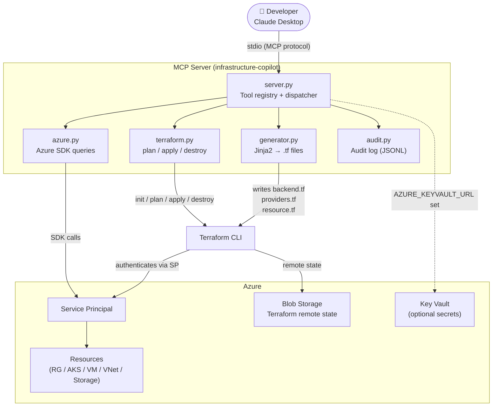
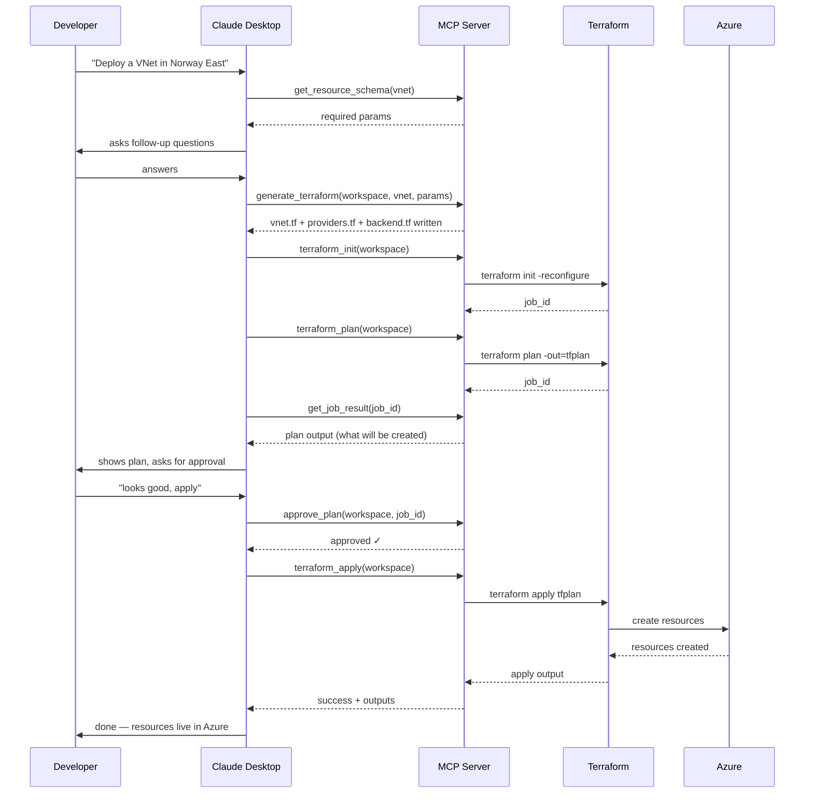

# Infrastructure Copilot

An MCP (Model Context Protocol) server that lets you design and deploy Azure infrastructure using natural language. Describe what you need, and the server generates Terraform code, runs plan/apply, and manages state — all from a conversation in Claude Desktop.

---

## Architecture



---

## Deploy Workflow



---

## Features

- **Natural language deploy** — describe resources, Claude asks follow-up questions and handles the rest
- **Plan approval gate** — apply is blocked until plan is explicitly approved
- **Destroy protection** — `confirm=true` required, with irreversibility warning
- **Remote state** — Terraform state stored in Azure Blob Storage (shared, locked)
- **Audit logging** — every tool call logged to `logs/audit.jsonl`
- **Workspace validation** — checks `.tf` files exist before running plan/apply
- **Azure Key Vault** — optional secret management instead of `.env`
- **Background jobs** — long-running Terraform commands run async, poll with `get_job_result`
- **Supports:** Resource Groups, AKS, Virtual Machines, Storage Accounts, Virtual Networks

---

## Prerequisites

| Tool | Version |
|------|---------|
| Python | >= 3.11 |
| Terraform | >= 1.6 |
| Azure CLI | >= 2.50 (for initial setup) |

---

## Setup

### 1. Clone and install

```bash
git clone https://github.com/Mohamedcreativecloud/infrastructure-copilot.git
cd infrastructure-copilot
python -m venv .venv
source .venv/bin/activate        # Windows: .venv\Scripts\activate
pip install -r requirements.txt
```

### 2. Create an Azure Service Principal

```bash
az login
az ad sp create-for-rbac \
  --name "infrastructure-copilot-sp" \
  --role Contributor \
  --scopes /subscriptions/<SUBSCRIPTION_ID>
```

Copy the output values into your `.env` file:

```bash
cp .env.example .env
# edit .env with your values
```

### 3. Create remote state backend

```bash
az group create --name tfstate-rg --location norwayeast

az storage account create \
  --name <unique-name> \
  --resource-group tfstate-rg \
  --location norwayeast \
  --sku Standard_LRS

az storage container create \
  --name tfstate \
  --account-name <unique-name> \
  --auth-mode login
```

Add the storage account name to `.env` as `TFSTATE_STORAGE_ACCOUNT`.

### 4. Configure Claude Desktop

Open your Claude Desktop config file:

- **macOS**: `~/Library/Application Support/Claude/claude_desktop_config.json`
- **Windows**: `%APPDATA%\Claude\claude_desktop_config.json`

```json
{
  "mcpServers": {
    "infrastructure-copilot": {
      "command": "python",
      "args": ["run_server.py"],
      "cwd": "/absolute/path/to/infrastructure-copilot"
    }
  }
}
```

Restart Claude Desktop — the tools will appear automatically.

---

## Usage Examples

```
"Create a resource group called prod-rg in Norway East"

"Deploy an AKS cluster with 3 nodes, autoscaling up to 10, in prod-rg"

"Show me all VMs in my subscription"

"What will happen if I apply the dev workspace?"

"Show me the last 20 audit log entries"
```

---

## Project Structure

```
infrastructure-copilot/
├── mcp_server/
│   ├── server.py          # MCP tool registry + dispatcher + audit wiring
│   ├── config.py          # Env config + Key Vault fallback
│   ├── audit.py           # Append-only JSONL audit logger
│   └── tools/
│       ├── terraform.py   # init / plan / approve / apply / destroy
│       ├── azure.py       # Azure SDK read queries
│       └── generator.py   # Jinja2 template rendering + backend.tf
│   └── templates/
│       ├── backend.tf.j2  # Azure Blob remote state config
│       ├── providers.tf.j2
│       ├── resource_group.tf.j2
│       ├── aks.tf.j2
│       ├── vm.tf.j2
│       ├── storage.tf.j2
│       └── vnet.tf.j2
├── run_server.py          # Entry point
├── .env.example
├── requirements.txt
└── logs/                  # audit.jsonl (gitignored)
```

---

## Available MCP Tools

| Tool | Description |
|------|-------------|
| `get_resource_schema` | Get required/optional params for a resource type |
| `generate_terraform` | Render `.tf` files from templates |
| `terraform_init` | Initialize a workspace |
| `terraform_plan` | Preview changes (returns job_id) |
| `approve_plan` | Approve a completed plan before apply |
| `terraform_apply` | Deploy to Azure (requires prior approval) |
| `terraform_destroy` | Tear down resources (requires `confirm=true`) |
| `terraform_output` | Read output values after apply |
| `get_job_result` | Poll a background job until done |
| `get_audit_log` | View recent tool call history |
| `list_workspaces` | List all workspaces |
| `get_workspace_files` | Read `.tf` files in a workspace |
| `list_resource_groups` | List Azure resource groups |
| `list_azure_resources` | List resources (filter by resource group) |
| `list_aks_clusters` | List AKS clusters |
| `list_vms` | List Virtual Machines |
| `list_storage_accounts` | List Storage Accounts |
| `get_subscription_info` | Current subscription details |

---

## Security

| Feature | Implementation |
|---------|---------------|
| Credentials | `.env` (gitignored) or Azure Key Vault |
| Remote state | Azure Blob Storage with locking |
| Apply gate | `approve_plan` required before every apply |
| Destroy guard | `confirm=true` required, irreversibility warning |
| Audit trail | `logs/audit.jsonl` — every tool call logged |
| Workspace names | Validated against `^[a-zA-Z0-9_\-]+$` |
| Sensitive files | `.env`, `logs/`, `terraform/workspaces/` all gitignored |

---

## License

MIT
